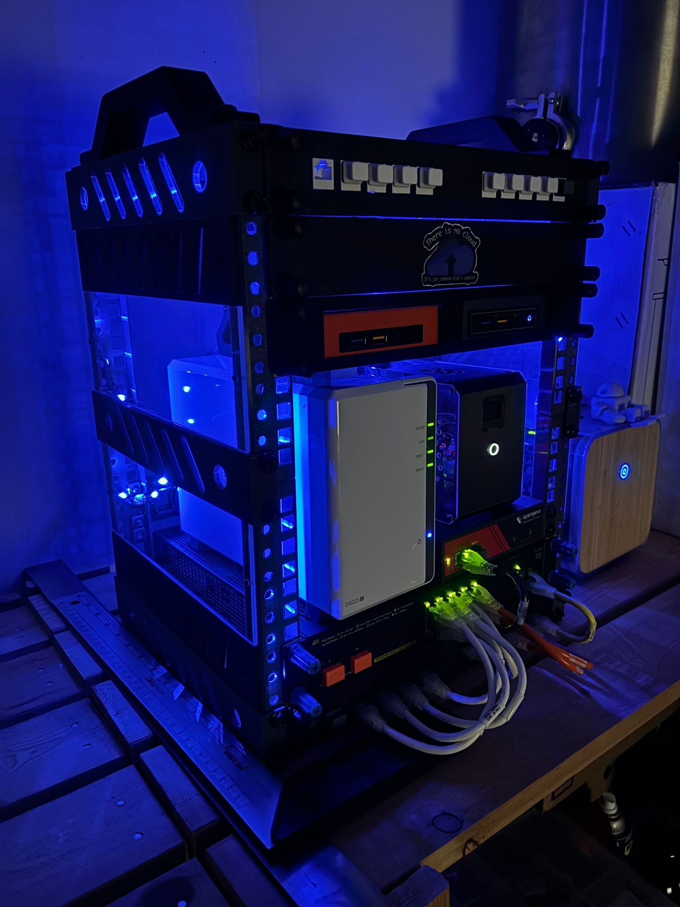

# Homelab Mini-Rack 3D Printed

#homelab #minirack #3dprinter #network

## Introduction:

This is a remix of one of the many 10" mini rack projects available. Actually this is my version 2 🚀️ , once the V1 was not robust enough to have handles, and I wasn't happy with that version. This is the 3rd or 4th generation, as it is a remix of a remis of another remix ...

My target was to create a rack to organize all my stuf, using real network rack nuts and rack studs. That is the reason to use square holes.

I printed all gray components used on the frame with PETG, and almost all the panels and the handle using black PLA. For the side panels, I decided to use acrylic sheets, leftover from my 3d printer enclosure.

To print all these parts, i used my tiny Bambu A1 mini. Using some imagination and super glue, I was able print everything. Because most of pieces are larger than my 3D printer heatbed, i had 2 options 2:

* easy: try to print in diagonal (rails, for example)
* not so easy: use the Bambu Studio feature “CUT”, with option “Dovetail”.
  With this option you can split your piece in 2 parts, print them, and
  then use superglue to assembly them.

### Rack Construction:

Some differences from the original design i had to create:

* **larger** : this rack is 10inches considering the internal part, not the
  external of the rack. I had to extend the original design to accommodate
  my Aruba 8p Switch.
* **new holes** : as I said, I was planning to use real rack mount cage nuts and/or rackstuds (actually I'm using
  both), and I changed the original circular holes to **square holes**. But only the internal ones where the devices will be attached.
* **new handle**: to be easier to print using my A1 mini, without cuts.
* **new front panels** : 1 for 10p x RJ45 and a 2nd one to install 2 x Intel NUCs using only 1 RU

With the new STL files, I started printing the rails - 8 in total.

Then I printed the foot (2) and the top (also 2).

Next I printed 6 side panels.

This was enough to assembly the 2 sides of my rack: left and right. Check the picture with both sides before installing all devices.

Next I printed the 2 handles and mounted them.

Finally, I moved the front and back panels from my old rack to the new rack: ethernet cables, blank panel, Intel NUCs, etc.

And last but not least, I cut 4 pieces of acrylic (2 x RU each) and install them as side panels.

And for the cherry on the top, LED Strips ... why not, heh ?! 😄

### Part List

What I have installed in this rack, so far, bottom to top:

- patch panel with 10 ports
- Aruba switch 8p
- 4 rack units where I have: Opengear, Raspberry Pi Server, Synalogy NAS
- panel with 2 Intel NUC Servers
- blanck panel (it's gonna have a environment monitor on this panel, soon)
- patch panel with 10 ports

Behind the rack (not shown in the pictures), attached to the rail, there is a power monitor. This is a simple Wifi power monitor that is connected to the UPS where all devices are connected to. This power monitor is connected to my HomeAssistant where I can have data and graph about my Homelab power consumption. ❤️

And, if you want to have access to the 3D files (STL), here are the links:

1) Printables [here](https://www.printables.com/model/1344769-10-mini-rack-remixhttps:/)
2) Makerworld [here](https://makerworld.com/en/models/1571368-10-plus-mini-rackhttps:/)

### Rack Inside:

what is running inside:

- a proxmox cluster with 3 nodes
- raspberry server with docker containers: PiHole, IOT Stack, Grafana, Netdata, etc
- 8p Giga switch
- console terminal (opengear)
- Synology NAS
- Pfsense virtual with VPN to my Oracle OCI instance
- etc

### To-do Improvements:

Because it's a live project, it's always open to new add-ons. For example:

- router is still not here: it's physically in another room
- top of the rack: still missing something to close it (lid). DONE
- FAN: not sure if a fan to push hot air from inside the rack to the top, or to the back of the rack DONE
- temperature/humidity display - DONE

Comments: the top of the rack is actually a FAN low, pushing all hot air from inside the rack to the top of the rack.
This is actually a real solution used in some datacenters using the concept that hot air goes UP, and you place a fan blowing the hot air upwards.
For the display with TEMP/HUMID, check out my proj11, where I created a solution using ESP32 running SNMP to monitor all these information from my rack.

